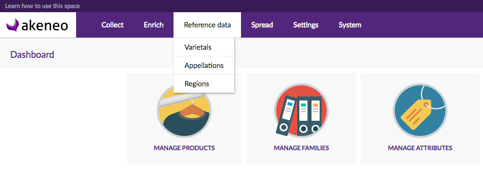

# References extension

Wine industry references data manager for OpenWines:

- Varietals
- Regions
- Appelations



Akeneo PIM bundle based on [Akeneo PIM 1.7 Community Edition](https://www.akeneo.com/download)


## Requirements

| ReferencesBundle   | Akeneo PIM Community Edition |
|:------------------:|:----------------------------:|
| dev-master         | v1.7.*                       |

## Prerequisites

Download [Akeneo PIM 1.7](https://www.akeneo.com/download/)

Edit `app/config/parameters.yml` and use `minimal` dataset:

```yaml
# /app/config/parameters.yml
parameters:
    installer_data: PimInstallerBundle:minimal
```

Then install Akeneo PIM following
- [system requirements](https://docs.akeneo.com/1.7/developer_guide/installation/system_requirements/system_install_debian8.html)
- [step by step instructions](https://docs.akeneo.com/latest/developer_guide/installation/installation_ce_archive.html)

## Installation

Now that your Akeneo PIM instance is up and running, 
install this bundle with composer (see requirements section):

```bash
php composer.phar require openwines/references-bundle "dev-master"
```

Enable the bundle in the `app/AppKernel.php` file in the existing `registerBundles()` method:

```php
protected function registerProjectBundles()
{
    return [
        // your app bundles should be registered here
        new Pim\Bundle\CustomEntityBundle\PimCustomEntityBundle(),
        new OpenWines\ReferencesBundle\OpenWinesReferencesBundle(),
    ];
```

Add the following lines **at the end** of your app/config/routing.yml :

```yaml
    pim_customentity:
        prefix: /reference-data
        resource: "@PimCustomEntityBundle/Resources/config/routing.yml"
```

Update your database schema:

```bash
php app/console doctrine:schema:update -e=prod --force
```


## TODO

See [TODO.md](TODO.md)


## Licence

- OSL-V3.0
